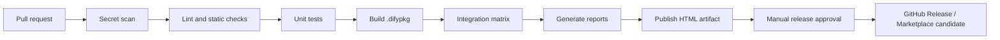

# CI/CD Design — Not Yet Connected

This document is a design only. No GitHub Actions workflow is enabled in Phase 9.

## Proposed pipeline

## Jobs

### 1. hygiene

- Detect secrets and private keys before packaging.
- Validate manifest YAML and required Marketplace metadata.
- Check Markdown links and PowerShell/Python syntax.
- Enforce that generated evidence and package do not contain credentials.

### 2. lint-unit

- Python formatting/linting and type checks after tools are selected.
- Pester or parser validation for PowerShell.
- Adapter, SQL validator, formatter, and error-mapping unit tests.
- Run on Windows and Linux where behavior differs.

### 3. package

- Restore pinned Python wheels.
- Build the Linux `amd64` `.difypkg` with the Dify Plugin CLI.
- Inspect archive contents and emit SHA-256.
- Upload the package only as a CI artifact; do not publish yet.

### 4. integration

- MySQL and PostgreSQL can run as service containers.
- DM8 and later vendor databases require self-hosted runners or an approved external test environment.
- Run Provider and Tool suites everywhere possible.
- Run `verify_all.ps1` only when a Dify stack, published Workflow, and ephemeral Workflow API key are available.
- A missing vendor environment must be reported as a gated job, never disguised as a passing SKIP for release.

### 5. reports

- Download JSON evidence from integration jobs.
- Run `generate_reports.ps1` into a clean generated directory.
- Validate totals against source JSON.
- Upload Technical, Executive, Verification, Release Notes, and Dashboard artifacts.

### 6. release

- Trigger only from an approved version tag.
- Require all mandatory databases and zero FAIL/SKIP.
- Attach `.difypkg`, checksum, release notes, compatibility matrix, and verification summary.
- Marketplace publication remains a separate human approval.

## Security model

- Use GitHub Environments for vendor database and publication secrets.
- Never print Workflow API keys or database passwords.
- Give PRs from forks no access to integration secrets.
- Pin third-party Actions by commit SHA when implementation begins.
- Set minimal `permissions`; release job alone receives content write permission.

## Suggested future files

- `.github/workflows/ci.yml`
- `.github/workflows/integration.yml`
- `.github/workflows/release.yml`
- `.github/dependabot.yml`

These files should be added only after runners, secret ownership, branch protection, and the mandatory/optional database policy are approved.
