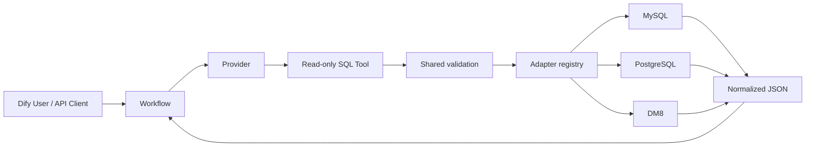
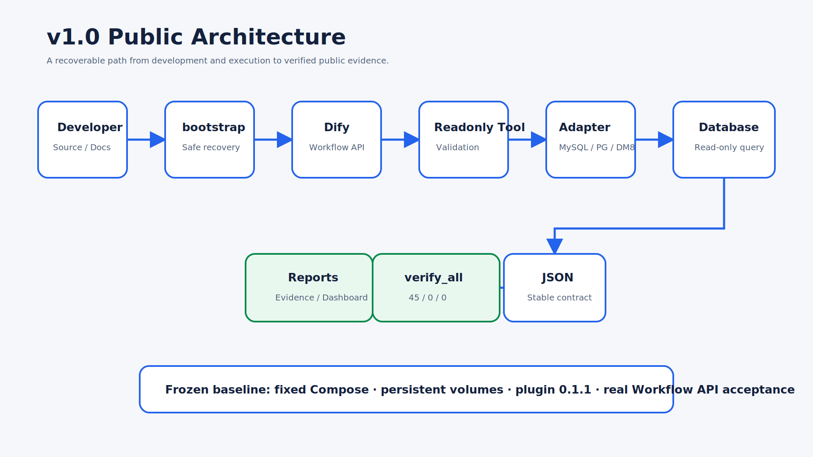
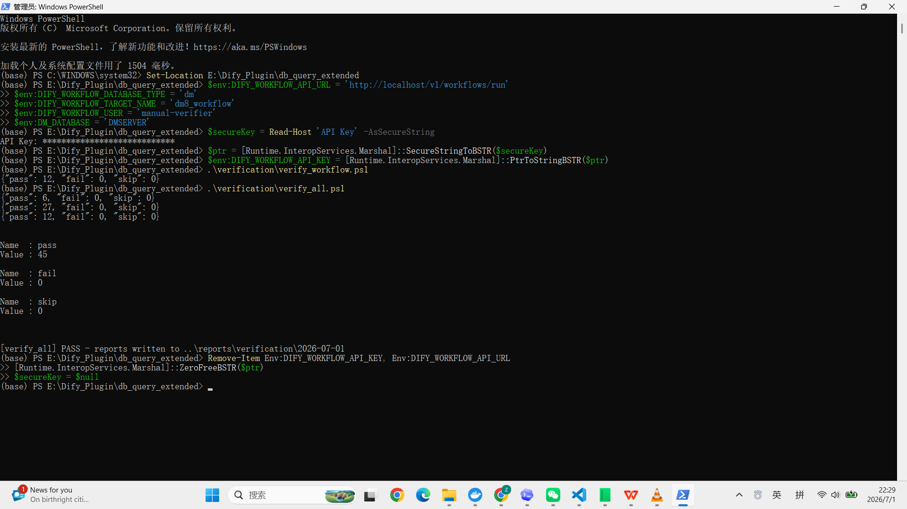

# db_query_extended

面向 Dify 的多数据库只读 SQL 查询插件。它把 Provider 凭据、SQL 安全策略、数据库 Adapter、结构化 JSON 输出和 Workflow API 验收整合为一条可维护链路。

> v1.0.0 · **RELEASED** · Technical Baseline **FROZEN** · **45 PASS / 0 FAIL / 0 SKIP**

## 为什么做这个项目

Dify 工作流需要以统一、可审计的方式读取不同数据库，但数据库驱动、超时语义、类型序列化和 SQL 安全边界并不一致。本项目通过稳定 Tool 合约和可扩展 Adapter 隔离差异，让新增数据库不必复制整个插件，也不必削弱只读安全策略。

## 能解决什么

- 在 Dify Workspace 中统一配置数据库 Provider。
- 在 Workflow 中执行单条只读 `SELECT` / `WITH ... SELECT`。
- 限制返回行数和执行时间，输出稳定 JSON。
- 拦截 DML、DDL、多语句及其他危险 SQL。
- 用 Provider、Tool、Workflow/API 三层自动化验证真实运行链路。

## 支持状态

| Database | Provider | Workflow/API | Unicode | Status |
| --- | --- | --- | --- | --- |
| MySQL 8.4 | Yes | verified baseline | Yes | Supported |
| PostgreSQL 16 | Yes | verified baseline | Yes | Supported |
| DM8 | Yes | real acceptance | Yes | Supported |
| KingbaseES / Oracle / SQL Server / SQLite | No | No | No | Roadmap |

完整矩阵见 [TEST_MATRIX.md](TEST_MATRIX.md)。

## 架构



详细图：[Plugin](architecture/plugin_architecture.md) · [Adapter](architecture/adapter_architecture.md) · [Workflow](architecture/workflow_architecture.md) · [Verification](architecture/verification_architecture.md)

## Quick Start

已配置的基线机器：

```powershell
git clone https://github.com/B7G1/Dify_Plugin.git E:\Dify_Plugin
Set-Location E:\Dify_Plugin
.\bootstrap.ps1
```

若本机策略禁止直接运行脚本，可使用 `powershell -NoProfile -ExecutionPolicy Bypass -File .\bootstrap.ps1`，仅对该进程生效。

`bootstrap.ps1` 会检查 Git、WSL、Docker、Python、固定 Dify 源码树和启动脚本，然后只通过 `start_dify.ps1` 启动 `dify` Compose 项目并运行 preflight。它不会删除或重建 Volume。

全新电脑仍需先安装 Docker Desktop/WSL，并准备当前固定 Dify fork、DM8 服务和人工凭据。原因及完整顺序见 [bootstrap.md](bootstrap.md) 和 [迁移指南](reports/release/v1.0/Migration_Guide.md)。

## 恢复与验证

环境身份与恢复入口以 [BASELINE.md](BASELINE.md) 为准。设置 Workflow API 环境变量后运行：

```powershell
& '.\db_query_extended\verification\verify_all.ps1' `
  -OutputDir '.\reports\verification\<date>\release_candidate'
```

发布门槛为零 FAIL、零 SKIP，并保留机器 JSON。API Key 只能临时注入进程，禁止写入脚本、报告或 Git。

## 开发

- 新人入口：[Developer Guide](Developer_Guide.md)
- Adapter 模板：[adapter_template](adapter_template/README.md)
- 发布检查：[RELEASE_CHECKLIST.md](RELEASE_CHECKLIST.md)
- v1.0 资料：[Release package](reports/release/v1.0/README.md)
- 机器证据：[45/0/0 result](reports/verification/2026-07-01/final_cold_boot/README.md)
- 文档站：[Dashboard](reports/html_reports/2026-07-01_phase7_1_final/dashboard.html)

## Screenshots

当前截图已经过项目所有者人工最终确认，可作为 v1.0.0 的公开展示、答辩和演示材料。





| View | Repository path | State |
| --- | --- | --- |
| Plugin installed/enabled | `docs/images/plugin-installed.png` | PASS — manually approved |
| Provider validation | `docs/images/provider-validation.png` | PASS — manually approved |
| Workflow success | `docs/images/workflow-success.png` | PASS — manually approved |
| v1.0.0 Dashboard | `docs/images/dashboard-v1.0.png` | PASS — manually approved |
| Automated verification | `docs/images/verification-45pass.png` | public-ready, real 1920×1080 capture |
| Cold boot | `docs/images/cold-boot.png` | public-ready evidence diagram based on accepted facts |

截图审计见 [docs/images/README.md](docs/images/README.md)。1918×1078 与 1920×1080 的细微差异仅为后续视觉规范建议，不影响当前发布。

## FAQ

**为什么只允许只读 SQL？**
插件面向工作流取数，不承担数据库管理职责。只读边界降低误操作和提示注入带来的风险。

**为什么不能直接运行 `docker compose up`？**
固定启动入口管理 Compose project、override、PostgreSQL/Weaviate named volume 和 preflight；绕过会破坏可恢复性。

**换电脑能否完全一键恢复？**
不能完全无人值守。Docker/WSL 安装、Dify fork、DM8 服务、数据库备份和凭据涉及管理员权限、外部资源或秘密，必须显式准备。

**如何新增数据库？**
复制 `adapter_template/`，实现 Adapter 合约，添加 Provider/Tool/Workflow/API 测试，且保留全部 v1.0 回归。

**项目现在可发布到 Marketplace 吗？**
v1.0.0 已正式 Released；提交 Dify Marketplace 仍需完成许可证选择和官方 schema/联系人审核，见 [Marketplace_Preparation.md](Marketplace_Preparation.md)。

## Project status

- Version: v1.0.0
- Plugin: 0.1.1
- Status: RELEASED
- Technical Baseline: FROZEN
- Environment: READY
- Screenshot Review: PASS
- Public Release: READY
- Lifecycle: COMPLETED
- Next phase: Phase 10 — KingbaseES Adapter
- Business logic changes in Phase 9: none
- Roadmap: [ROADMAP.md](ROADMAP.md)
