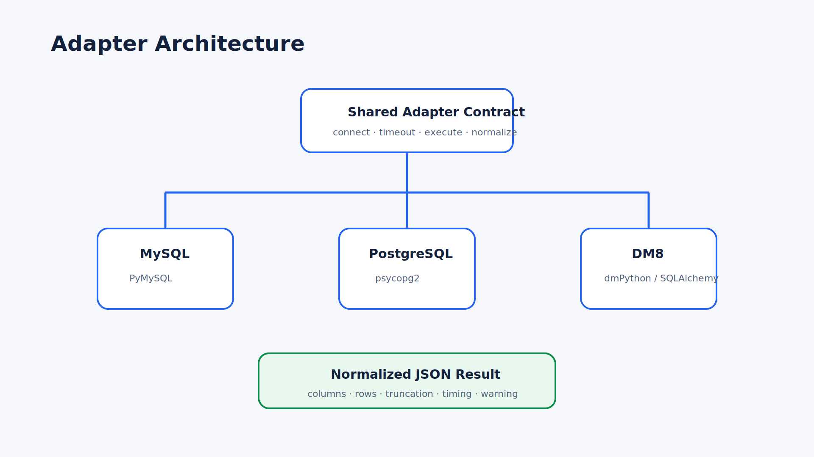
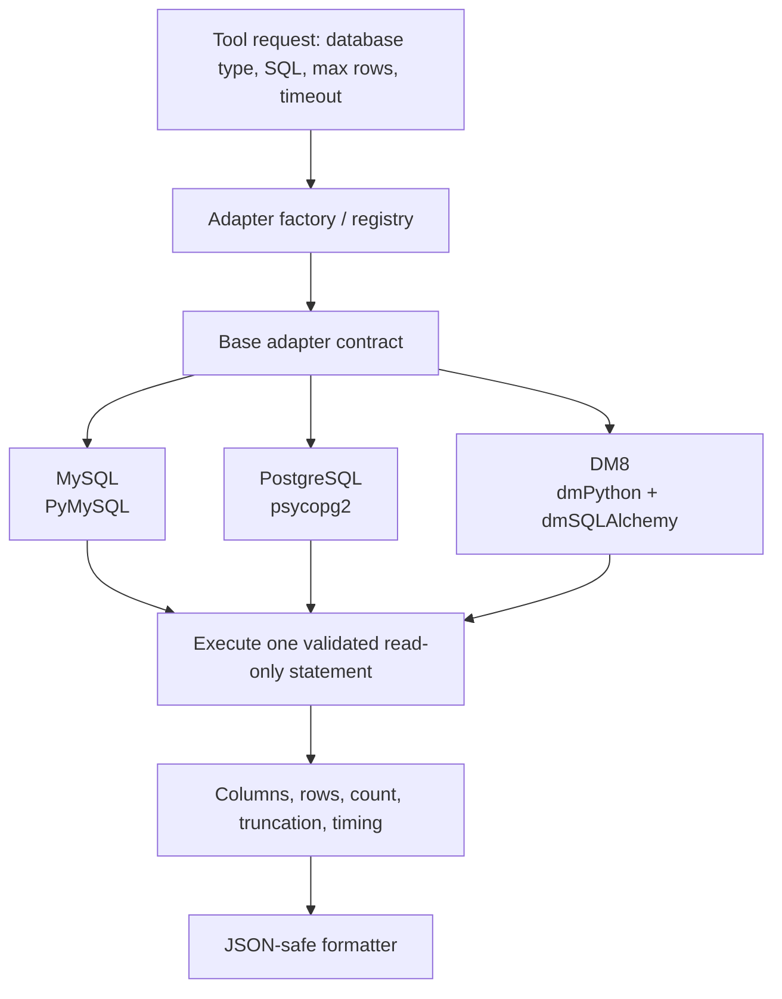

# Adapter Architecture

## Design

The adapter layer keeps the Tool contract database-neutral. New databases implement the same connection, timeout, execution, and error-mapping responsibilities without changing the Workflow contract.

## Extension contract

Every new adapter must provide:

1. Credential normalization without logging secrets.
2. Connection validation using a minimal read-only query.
3. Database-specific timeout setup.
4. One-statement execution after shared SQL validation.
5. Stable exception mapping and resource cleanup.
6. JSON-safe handling for dates, decimals, bytes, UUID-like values, and vendor types.

Shared validation remains the security boundary; vendor adapters must not weaken it.
