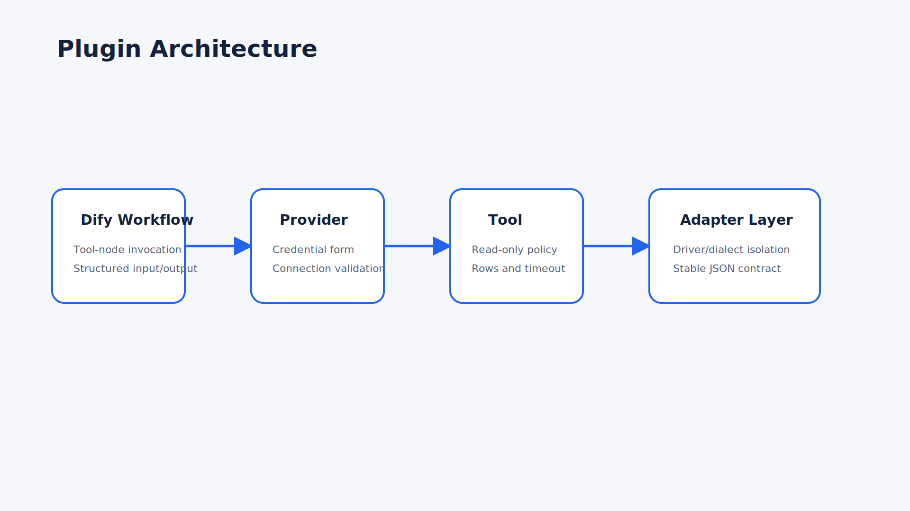
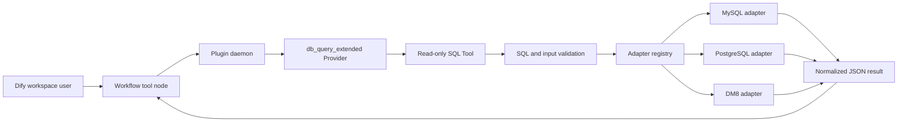

# Plugin Architecture

## Responsibility

The plugin exposes one read-only database query capability to Dify. Provider configuration owns connection credentials; the Tool owns request validation and result presentation; adapters isolate database-specific behavior.

## Boundaries

- `provider/`: credential schema and credential validation entry.
- `tools/`: Dify Tool input/output contract and orchestration.
- `utils/validation.py` and `utils/sql_validator.py`: read-only policy.
- `utils/adapters/`: database dialect and driver behavior.
- `utils/result_formatter.py`: stable JSON-safe response contract.

Credentials never enter logs or reports. Runtime failures are translated into controlled plugin errors rather than leaking connection URLs.
