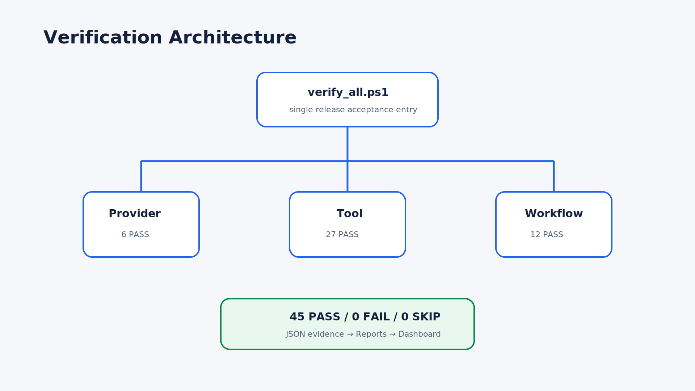
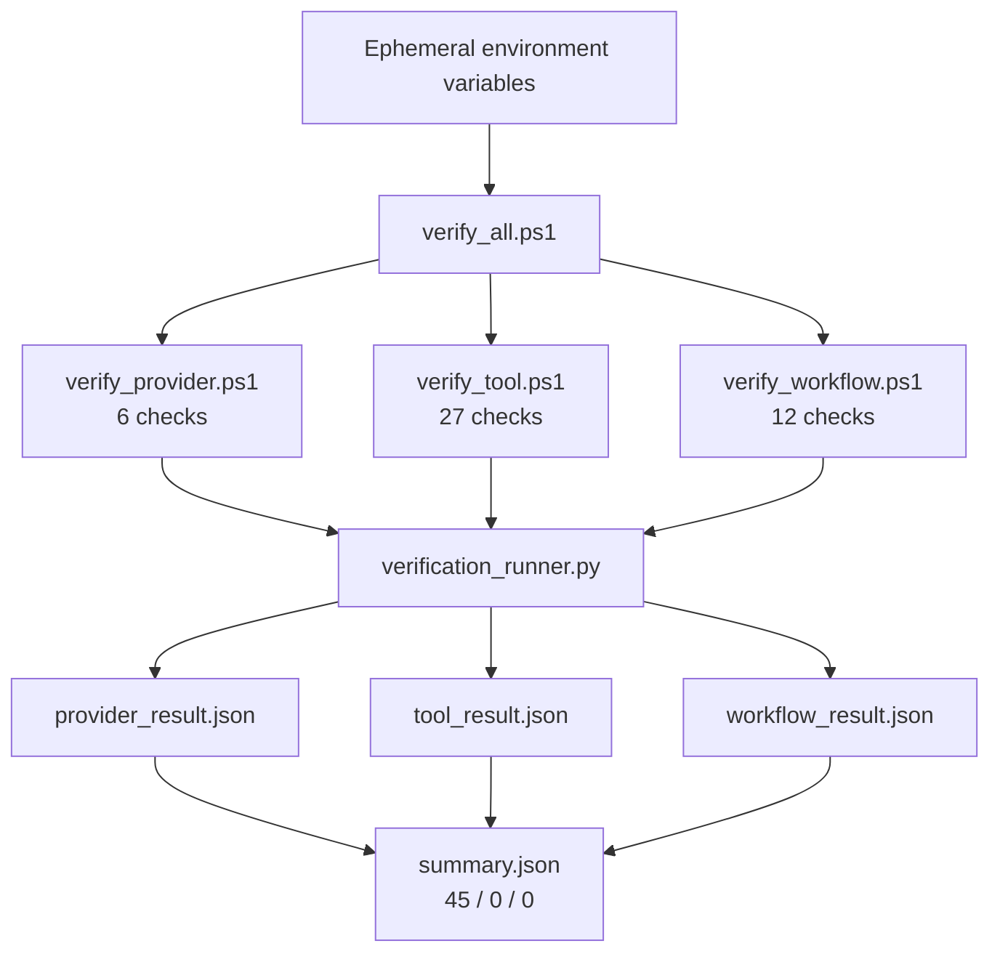
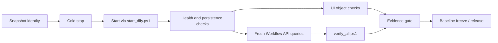

# Verification Architecture

## Automated suites

## Full acceptance flow

Machine JSON is authoritative for counts. Human-readable reports summarize it and must never replace or silently reinterpret it.
