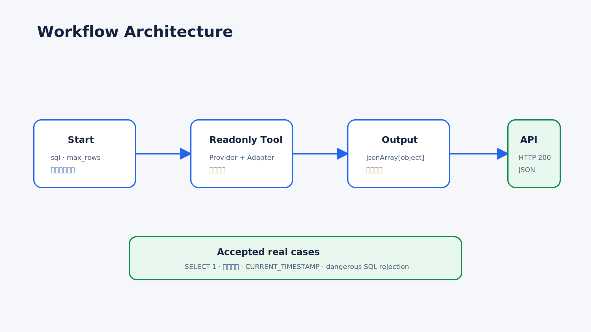
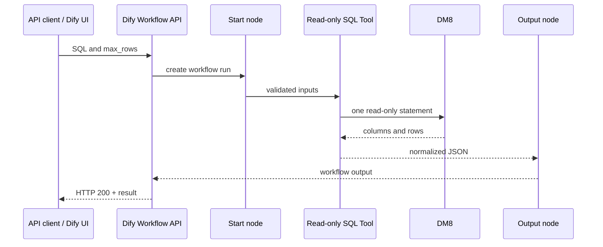

# Workflow Architecture

## Published path

The accepted Workflow is `DM8 Readonly SQL Acceptance`, ID `ec11fbde-d77c-4818-bcdf-b2b483dffe3d`, with Start → Tool → Output. Its API URL is `http://localhost/v1/workflows/run`; the API key is never stored in the repository.

## Acceptance contract

- Workflow status must be success.
- DM8 `SELECT 1`, Unicode text, and current timestamp must survive JSON serialization.
- Row limits and truncation metadata must be correct.
- Dangerous SQL must be rejected before reaching the database.
