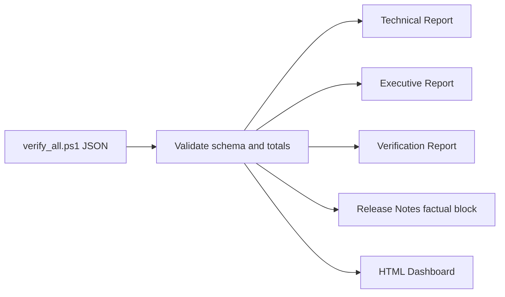

# Automated Report Generation Design

`generate_reports.ps1` proves that five outputs can share one machine-readable source without copying test totals manually:



Example preview:

```powershell
.\generate_reports.ps1 `
  -EvidenceDirectory '.\reports\verification\2026-07-01\final_cold_boot' `
  -OutputDirectory '.\reports\generated\v1.0' `
  -WhatIf
```

Remove `-WhatIf` to generate files. Generated reports are drafts: architecture explanation, risk interpretation, limitations, compatibility, and release approval remain curated human content. CI must compare reported totals to `summary.json`, reject missing fields, and never consume logs as a credential source.
