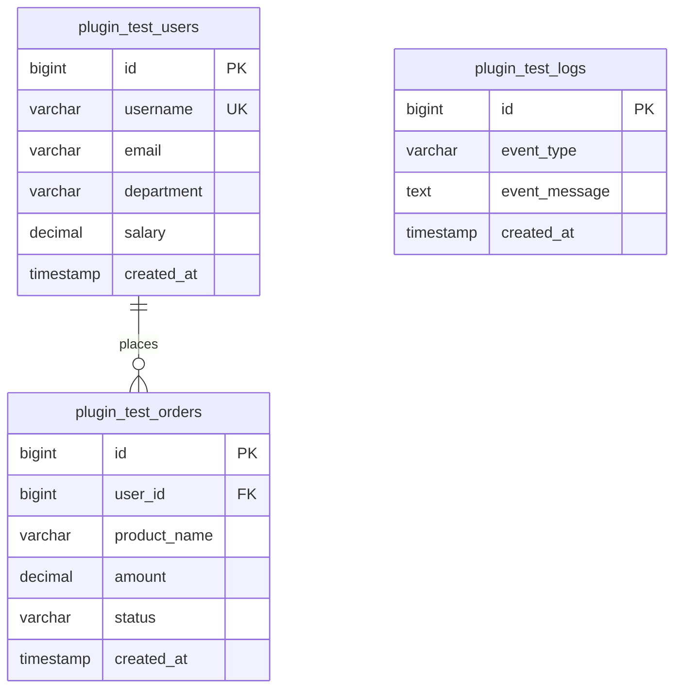

# Day 2：本地测试数据库搭建报告

## 环境信息

| 项目 | 版本 |
| --- | --- |
| Docker Engine（CLI） | 29.5.2 |
| Docker Compose（CLI） | v5.1.3 |
| MySQL 镜像 | 8.4 |
| PostgreSQL 镜像 | 16 |

## 可复现部署

在 Docker Desktop 启动后，进入本目录执行：

```powershell
docker compose up -d
docker compose ps
```

初始化由镜像入口点自动执行，数据持久化在命名卷 `mysql_data`、`postgres_data`。如需回到初始状态，执行 `docker compose down -v` 再启动。完整步骤和连接信息见 [README.md](README.md)。

## 数据库结构



`plugin_test_orders.status` 仅允许 `completed`、`pending`、`cancelled`。主键、关联键、状态与时间字段均建立了适合查询测试的索引。

## 测试数据

两种数据库使用相同的确定性数据集：12 名用户、24 笔订单、10 条日志。用户数据包含中英文、重音字符、单引号、`NULL` 邮箱/部门/薪资；订单覆盖三种状态；日志覆盖 LIMIT、ORDER BY、COUNT 与时间范围查询。

## 连接信息

| 数据库 | Host | Port | Database | User | Password |
| --- | --- | ---: | --- | --- | --- |
| MySQL | localhost | 3306 | plugin_test | plugin_test_user | plugin_test_password |
| PostgreSQL | localhost | 5432 | plugin_test | plugin_test_user | plugin_test_password |

仅用于本地测试。Dify Provider 配置应使用对应的宿主机地址与端口；容器间联调时使用 Compose 服务名 `mysql` 或 `postgres` 与容器端口。

## 验证 SQL

统一、可直接用于两种数据库的 SQL 位于 [verification/verification.sql](verification/verification.sql)，包含：基础查询、LIMIT、COUNT、WHERE、JOIN、聚合和时间查询。可直接运行 [verification/verify.ps1](verification/verify.ps1)，脚本会启动服务、等待健康状态，并分别执行该 SQL 文件。

## 验证结果

2026-06-23 已在本机 Docker Desktop 上实际执行：

- `docker compose config` 成功，配置可被 Compose 正确解析。
- MySQL 8.4 与 PostgreSQL 16 容器均启动并通过健康检查。
- 两库完成建表和数据导入：`plugin_test_users` 12 行、`plugin_test_orders` 24 行、`plugin_test_logs` 10 行。
- [verification/verify.ps1](verification/verify.ps1) 成功执行两库通用验收 SQL：两库均返回 5 条 LIMIT 结果，COUNT 均为 12，状态过滤返回 14 条 completed 订单，JOIN 返回 24 条记录，聚合及时间查询均成功。
- 验证脚本已显式使用 UTF-8 控制台输出，保留中文与特殊字符数据的可观察性。
