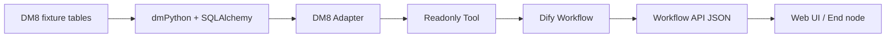

# DM8 Data Retrieval Validation

状态：**PARTIAL PASS — 核心读取链路已真实执行，完整数据能力证据尚未闭环**  
审计日期：2026-07-03（America/Chicago）

## 1. 验收目标与判定边界

本章节回答的不是“Dify 能否在 DM8 环境中启动”，而是：

> DM8 中预置的真实测试数据，能否经过 SQLAlchemy/dmPython、DM8 Adapter、Dify Tool、Workflow API 和 JSON 输出，被正确读取、转换并返回给用户。

原 `45 PASS / 0 FAIL / 0 SKIP` 是真实执行结果，但同时包含 Provider、通用 Tool 契约、安全校验和 Workflow 用例。它不能单独等价为“14 类 DM8 数据能力全部通过”。本章按逐项证据重新判定。

判定规则：

- **PASS**：有真实 DM8 执行结果，且断言验证了数据值或确定性行数；
- **PARTIAL**：真实执行成功，但归档证据只保留摘要，未保留足以独立复核的返回值；
- **NOT EVIDENCED**：存在测试数据或 SQL 设计，但没有对应的真实 Workflow/API/JSON 结果；
- **N/A**：DM8 当前类型/方案明确不适用，且有依据。当前没有项目被直接判为 N/A。

## 2. 确定性测试数据

数据源由 [`local_test_db/dm8/01_admin_setup.sql`](../../../local_test_db/dm8/01_admin_setup.sql) 创建：

| 表 | 行数 | 能力特征 |
|---|---:|---|
| `PLUGIN_TEST_USERS` | 12 | VARCHAR、NULL、DECIMAL、TIMESTAMP、部门分组 |
| `PLUGIN_TEST_ORDERS` | 24 | 外键、状态过滤、JOIN、金额聚合 |
| `PLUGIN_TEST_LOGS` | 10 | CLOB、时间过滤、长文本基础类型 |

初始化脚本中的姓名为 ASCII，以规避当时 Windows DIsql 文件编码问题；Unicode 由真实 dmPython 参数绑定和 Workflow API 字面量查询单独验证。

## 3. 数据能力验收矩阵

| # | 能力 | 验证目的 | 实际执行 SQL/机制 | 预期 | 实际证据 | 结论 |
|---:|---|---|---|---|---|---|
| 1 | `SELECT *` | 读取表结构和多列业务行 | `SELECT * FROM plugin_test_users LIMIT 5` | 5 行用户数据 | Workflow 与 Tool 均断言 `row_count=5`；归档未保留字段值 | **PARTIAL** |
| 2 | `WHERE` | 验证条件过滤 | `SELECT * FROM plugin_test_orders WHERE status='completed'` | 14 行 completed 订单 | Workflow/Tool 均断言 `row_count=14` | **PASS** |
| 3 | `ORDER BY` | 验证确定性排序及读取 | `SELECT * FROM plugin_test_users ORDER BY id` | 按 ID 排序 | 真实执行并由 `max_rows=3` 截断；归档未保留前三行 ID | **PARTIAL** |
| 4 | `LIMIT` | 验证 DM8 方言及限制行数 | `SELECT * FROM plugin_test_users LIMIT 5` | 5 行 | Workflow/Tool 均为 5 行 | **PASS** |
| 5 | `COUNT(*)` | 验证聚合标量返回 | `SELECT COUNT(*) AS total FROM plugin_test_users` | 1 行，值应为 12 | 归档只证明 `row_count=1`，未保存 `total=12` | **PARTIAL** |
| 6 | `GROUP BY` | 验证分组聚合 | `SELECT DEPARTMENT, AVG(SALARY) ... GROUP BY DEPARTMENT` | 各部门平均薪资 | SQL 已列入只读验证脚本，但无独立运行结果 artifact | **NOT EVIDENCED** |
| 7 | `JOIN` | 验证跨表关系读取 | 用户与订单按 ID JOIN，`LIMIT 10` | 10 行用户名/金额 | Workflow/Tool 均断言 `row_count=10` | **PASS** |
| 8 | 中文字符 | 验证 UTF-8 全链路 | `SELECT '中文测试' AS "UNICODE_TEXT" FROM DUAL` | JSON 中精确等于 `中文测试` | Workflow runner 对返回值做精确断言；`unicode_utf8=PASS` | **PASS** |
| 9 | NULL | 验证空值到 JSON `null` | 查询 EMAIL/SALARY 为 NULL 的用户 | NULL 不丢失、不变成字符串 | fixture 与 SQL 已存在；无 Workflow JSON artifact | **NOT EVIDENCED** |
| 10 | JSON 类型 | 验证 DM8 JSON/文本映射 | 待按目标 DM8 版本确定类型及 SQL | JSON 内容可序列化 | 未记录服务端 JSON 类型能力，未执行 | **NOT EVIDENCED** |
| 11 | TEXT/CLOB | 验证大字段读取与序列化 | 查询 `PLUGIN_TEST_LOGS.EVENT_MESSAGE` | CLOB 内容完整或按契约截断 | CLOB fixture 已创建；无 Tool/Workflow 返回证据 | **NOT EVIDENCED** |
| 12 | 参数绑定 | 排除字符串拼接并验证 Unicode | dmPython `:unicode_text` 参数 | 参数值精确保留 | Tool suite `unicode_bind=PASS`，消息明确记录 dmPython/SQLAlchemy/JSON 均保留 Unicode | **PASS** |
| 13 | 多行返回 | 验证数组结构和行数 | LIMIT、WHERE、JOIN 查询 | 5/14/10 行 | 三类真实查询均满足确定性行数 | **PASS** |
| 14 | 空结果 | 验证空数组契约 | 建议：`WHERE ID=-1` | `rows=[]`, `row_count=0`, `success=true` | 未执行/未归档 | **NOT EVIDENCED** |

### 当前统计

- PASS：6
- PARTIAL：3
- NOT EVIDENCED：5
- FAIL：0

该统计是本次“数据能力专项审计”的覆盖统计，不替代也不改写历史 `45 PASS / 0 FAIL / 0 SKIP` 自动化结果。

## 4. Representative Query Results

本节直接摘录真实 DIsql 输出，并与对应 Workflow artifact 并列。数据库结果来源为 [`reports/verification/2026-06-29/dm8_environment_setup_output.txt`](../../verification/2026-06-29/dm8_environment_setup_output.txt)；Workflow 摘要来源为 [`workflow_dm8_result.json`](../../verification/2026-06-30/workflow_dm8_result.json)。

> 证据边界：DIsql artifact 保存了真实列和值；Workflow artifact 为避免保存业务 payload，只归档了 run ID、状态、行数和截断标记。因此下表中的 DM8 rows 是真实数据库输出，但不能冒充为 Workflow artifact 中已保存的 `rows`。

下列记录均来自项目专用的确定性测试 fixture，不是生产数据；示例邮箱和姓名属于合成测试数据，无需用虚构值替换。

### 4.1 SELECT * / LIMIT 5

执行 SQL：

```sql
SELECT *
FROM "PLUGIN_TEST_OWNER"."PLUGIN_TEST_USERS"
ORDER BY "ID"
LIMIT 5;
```

DM8 实际返回：

| ID | USERNAME | EMAIL | DEPARTMENT | SALARY | CREATED_AT |
|---:|---|---|---|---:|---|
| 1 | Zhang Wei | zhang.wei@example.com | Engineering | 18500 | 2025-01-03 09:15:00.000000 |
| 2 | Li Na | li.na@example.com | Product | 16200.5 | 2025-01-05 10:30:00.000000 |
| 3 | Alice Smith | alice.smith@example.com | Engineering | 19800 | 2025-01-07 08:45:00.000000 |
| 4 | Bob O'Connor | bob.oconnor@example.com | Sales | 14300 | 2025-01-09 14:20:00.000000 |
| 5 | Wang Xiaoming | `NULL` | Support | `NULL` | 2025-01-12 11:00:00.000000 |

同一逻辑查询通过 Workflow 执行时，归档摘要为：

```json
{
  "case": "limit_5",
  "status": "PASS",
  "workflow_run_id": "e7701a18-2361-4713-8670-85f87787ef95",
  "success": true,
  "row_count": 5,
  "truncated": false
}
```

当前 Workflow artifact 未保存 `columns` 和 `rows`，因此无法从该 artifact 逐字段复原 Workflow 最终 payload；不能把上面的 DIsql 表格写成 Workflow JSON rows。

### 4.2 WHERE 过滤

执行 SQL：

```sql
SELECT *
FROM "PLUGIN_TEST_OWNER"."PLUGIN_TEST_ORDERS"
WHERE "STATUS" = 'completed'
ORDER BY "ID";
```

DM8 实际返回前 5 行（完整输出共 14 行）：

| ID | USER_ID | PRODUCT_NAME | AMOUNT | STATUS | CREATED_AT |
|---:|---:|---|---:|---|---|
| 1 | 1 | Dify Pro License | 99 | completed | 2025-02-01 09:00:00.000000 |
| 2 | 1 | SQL Connector | 29 | completed | 2025-02-02 10:00:00.000000 |
| 4 | 3 | Analytics Pack | 199 | completed | 2025-02-04 12:00:00.000000 |
| 6 | 5 | Support Add-on | 19.99 | completed | 2025-02-06 14:00:00.000000 |
| 8 | 7 | API Credits | 250 | completed | 2025-02-08 16:00:00.000000 |

Workflow 归档摘要：

```json
{
  "case": "where",
  "status": "PASS",
  "workflow_run_id": "8a16c3dd-6aa7-409b-b752-8e49eb3866c0",
  "success": true,
  "row_count": 14,
  "truncated": false
}
```

这组证据能把确定性 DM8 记录与 Workflow 的 14 行断言对应起来；但 Workflow artifact 仍未保存 14 个 row objects。

### 4.3 JOIN

执行 SQL：

```sql
SELECT U."USERNAME", O."PRODUCT_NAME", O."AMOUNT"
FROM "PLUGIN_TEST_OWNER"."PLUGIN_TEST_USERS" U
JOIN "PLUGIN_TEST_OWNER"."PLUGIN_TEST_ORDERS" O
  ON U."ID" = O."USER_ID"
ORDER BY O."ID"
LIMIT 10;
```

DM8 实际返回前 5 行（完整输出共 10 行）：

| USERNAME | PRODUCT_NAME | AMOUNT |
|---|---|---:|
| Zhang Wei | Dify Pro License | 99 |
| Zhang Wei | SQL Connector | 29 |
| Li Na | Workflow Template | 49.5 |
| Alice Smith | Analytics Pack | 199 |
| Bob O'Connor | Team Seats x5 | 125 |

Workflow 归档摘要：

```json
{
  "case": "join",
  "status": "PASS",
  "workflow_run_id": "ae5823a5-a898-4cb2-81d1-f7485d5b63da",
  "success": true,
  "row_count": 10,
  "truncated": false
}
```

该证据显示 DM8 真正返回了用户名、产品名和金额，而不仅是连接成功；Workflow artifact 则证明同一类 JOIN 查询沿三节点链路成功返回 10 行。

### 4.4 COUNT(*)

执行 SQL：

```sql
SELECT COUNT(*) AS "USER_COUNT"
FROM "PLUGIN_TEST_OWNER"."PLUGIN_TEST_USERS";
```

DM8 实际返回：

| USER_COUNT |
|---:|
| 12 |

Workflow 归档摘要：

```json
{
  "case": "count",
  "status": "PASS",
  "workflow_run_id": "83b84636-1794-4763-a56a-9a06f8644e3b",
  "success": true,
  "row_count": 1,
  "truncated": false
}
```

DM8 artifact 明确证明聚合值为 `12`。Workflow artifact 仅证明返回一行，未保存该行中的 `TOTAL=12`，所以 COUNT 项仍保持原判定 **PARTIAL**。

### 4.5 Unicode

Workflow 执行 SQL：

```sql
SELECT '中文测试' AS "UNICODE_TEXT" FROM DUAL;
```

自动化 runner 对运行时返回对象执行了精确断言：

```python
result["rows"][0]["UNICODE_TEXT"] == "中文测试"
```

因此运行时被验证的字段和值为：

```json
{
  "UNICODE_TEXT": "中文测试"
}
```

归档摘要为：

```json
{
  "case": "unicode_utf8",
  "status": "PASS",
  "workflow_run_id": "f5ff0043-0c93-4909-b42f-5ec9fde9b35a",
  "success": true,
  "row_count": 1,
  "truncated": false
}
```

这里展示的字段和值来自真实运行时断言条件，不是凭 fixture 推导；但完整原始 Workflow JSON 没有被写入 artifact。

### 4.6 可见但不改变原判定的补充结果

同一 DIsql artifact 还保存了以下真实结果：

- NULL 查询返回 `Wang Xiaoming: EMAIL=NULL, SALARY=NULL` 和 `Noah Kim: EMAIL=NULL, SALARY=12800`；
- GROUP BY 返回 7 组，包括 `Engineering=19237.5`、`Product=16000.25`、`Support=12800`；
- 数据库初始化后计数为 Users `12`、Orders `24`、Logs `10`。

这些结果能证明 DM8 数据库层确实读取了 NULL 和分组值，但尚无对应的 Tool → Workflow → JSON → UI artifact。按照本次任务约束，NULL 和 GROUP BY 的原 `NOT EVIDENCED` 判定保持不变。

### 4.7 UI 证据

现有公开截图证明 Workflow 成功运行，但仓库中没有一张同时清晰展示上述业务 rows、且可与具体 run ID 绑定的 UI 截图。因此本节不声称已有字段级 UI 证据，也不使用 fixture 重建 UI 输出。

## 5. End-to-End Data Flow Validation



| 节点 | 必须证明的事实 | 当前证据 | 证据强度/缺口 |
|---|---|---|---|
| DM8 Database | 确定性业务数据实际存在 | 初始化 SQL；12/24/10 行设计；环境准备记录 | 有 fixture；应补数据库查询输出或截图 |
| dmPython | 驱动真正取回值 | `tool_result.json` 中 DM 查询和 `unicode_bind=PASS` | Unicode 有值级断言；其他用例多为行数断言 |
| SQLAlchemy | 引擎/类型转换可用 | Tool suite 真实 DM 执行；Unicode 消息明确记录 SQLAlchemy | 应补 Decimal/Timestamp/CLOB 的 DM 实值结果 |
| DM8 Adapter | schema、方言和连接参数正确 | DM Tool 6 个数据查询 PASS | 可证明查询执行；尚缺完整字段 payload |
| Dify Tool | 结果符合统一 JSON contract | Tool suite 记录 `row_count/truncated/max_rows` | 摘要未保存 rows/columns |
| Workflow | 三节点真实运行 | `workflow_dm8_result.json` 含 run ID、成功状态和行数 | 可追踪运行；未归档节点完整输出 |
| Workflow API | HTTP 链路返回正确 | 12 个 API 用例真实运行；Unicode 精确断言 | 多数 artifact 仅存摘要而非完整脱敏 JSON |
| Web UI | 用户看到数据 | 现有 Workflow 成功截图 | 需要包含非敏感业务行的真实输出截图才能形成值级闭环 |

## 6. 已成立的端到端事实

以下结论有机器证据支持：

1. DM8 表查询不是连接探针：Workflow 实际查询了用户表和订单表。
2. 条件过滤、JOIN、LIMIT 和多行返回经过真实 Workflow API 调用，行数与 fixture 一致。
3. Unicode 字符串从 DM8 查询结果进入 Workflow JSON 后仍精确等于 `中文测试`。
4. dmPython 参数绑定可返回 Unicode，且经过 SQLAlchemy 和 Tool JSON 格式化未损坏。
5. Tool 的 `max_rows` 在真实 DM8 多行查询上产生 `row_count=3, truncated=true`。

## 7. 尚不能宣称的结论

在补充真实证据前，不应宣称：

- 14 类数据能力已经全部验收；
- DM8 JSON 原生类型已经兼容；
- CLOB 大字段已经通过完整 Workflow/API 序列化；
- NULL 已在最终 JSON 中被验证为 `null`；
- GROUP BY 的实际分组值正确；
- 空结果契约已经在真实 DM8 Workflow 中验证；
- 每个查询的完整业务字段均已归档并可由第三方独立复核。

## 8. 补证验收标准

后续补证必须为每个缺口保存一组脱敏但可复核的证据：

1. SQL 原文和 fixture 版本；
2. DM8 直接查询结果；
3. Tool 节点 `columns/rows/row_count/truncated`；
4. Workflow run ID 与节点状态；
5. HTTP 状态及脱敏后的完整 JSON 输出；
6. Web UI 最终展示截图；
7. 自动断言结果和 artifact SHA-256。

只有上述证据覆盖 14 项且无 FAIL，才可将本章状态提升为 **DATA CAPABILITY PASS**。

## 9. 证据索引

- Workflow API：[`../../verification/2026-06-30/workflow_dm8_result.json`](../../verification/2026-06-30/workflow_dm8_result.json)
- 冷启动后 Workflow API：[`../../verification/2026-07-01/final_cold_boot/workflow_result.json`](../../verification/2026-07-01/final_cold_boot/workflow_result.json)
- Tool：[`../../verification/2026-07-01/tool_result.json`](../../verification/2026-07-01/tool_result.json)
- 数据初始化：[`../../../local_test_db/dm8/01_admin_setup.sql`](../../../local_test_db/dm8/01_admin_setup.sql)
- 只读 SQL 清单：[`../../../local_test_db/dm8/03_readonly_verify.sql`](../../../local_test_db/dm8/03_readonly_verify.sql)
- Unicode 专项：[`unicode_acceptance.md`](unicode_acceptance.md)
- DM8 DIsql 实际结果：[`../../verification/2026-06-29/dm8_environment_setup_output.txt`](../../verification/2026-06-29/dm8_environment_setup_output.txt)
