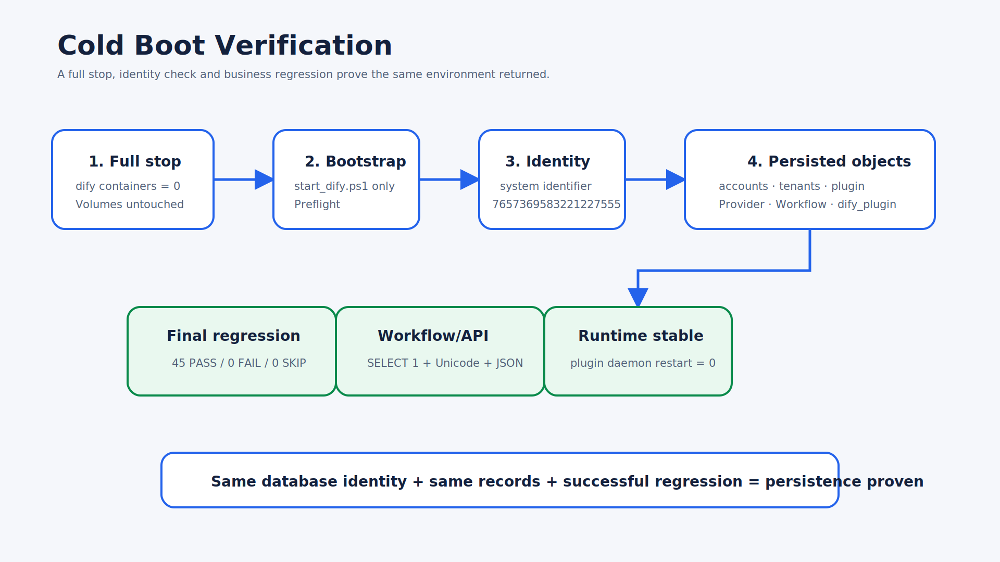

# Cold Boot Verification

## What was actually verified

1. The complete `dify` Compose project was stopped, including API, workers, Web, Nginx, sandbox, plugin daemon, PostgreSQL, Redis, and Weaviate.
2. Zero running `dify` project containers remained.
3. The environment was restarted only through `start_dify.ps1`.
4. PostgreSQL retained system identifier `7657369583221227555` and the same named volume.
5. `dify` and `dify_plugin` remained present; plugin daemon returned stable with restart count 0.
6. Plugin 0.1.1, Provider, and Workflow records remained available.
7. Fresh Workflow API queries and the full 45/0/0 suite passed.

## Why this proves persistence

- The administrator is stored in the same PostgreSQL cluster. An unchanged system identifier plus retained `accounts`/`tenants` records shows that startup did not initialize a replacement cluster.
- Plugin installation and Provider metadata are Console database records and plugin storage artifacts. They remained after all containers were removed from the running state and recreated by Compose.
- Workflow identity and API execution remained valid after restart, so the published application record and graph were not rebuilt from a report.

This evidence proves a controlled full-stack cold restart on the accepted machine. It does not claim that an untested backup can restore onto arbitrary hardware; that is covered by the migration procedure.
